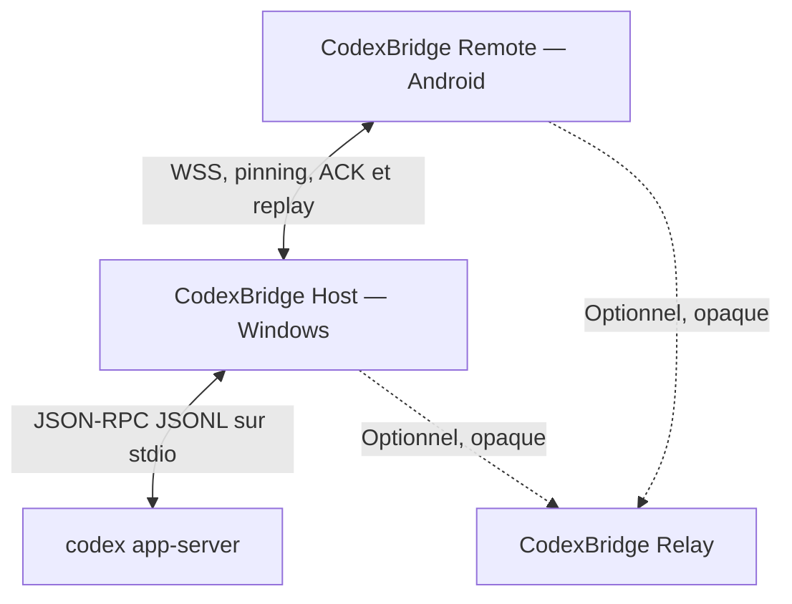

# CodexBridge Remote

CodexBridge Remote est un client tiers indépendant permettant de piloter l’installation locale de Codex sur un PC Windows depuis un téléphone Android. Il utilise l’interface locale officielle `codex app-server`; il n’intercepte pas l’application ChatGPT et ne copie jamais les credentials Codex.

> CodexBridge Remote n’est ni développé, ni approuvé, ni distribué par OpenAI. Codex et ChatGPT sont des marques de leurs propriétaires respectifs.

## Téléchargements

- [Page publique](https://neoxyne008.github.io/codexbridge-remote-downloads/)
- [APK Android direct](https://github.com/neoxyne008/codexbridge-remote-downloads/releases/latest/download/CodexBridge-Remote.apk)
- [Host Windows x64](https://github.com/neoxyne008/codexbridge-remote-downloads/releases/latest/download/CodexBridge-Windows-x64.zip)
- [Dernière Release](https://github.com/neoxyne008/codexbridge-remote-downloads/releases/latest)

## Architecture



Le protocole mobile est stable et distinct du JSON-RPC Codex. Chaque session logique survit au remplacement du WebSocket. Les réponses finales, approbations et changements d’état sont persistés dans une outbox SQLite avec séquence monotone, ACK cumulatif et replay de 24 heures. Les requêtes mutantes sont dédupliquées par `requestId` pendant 24 heures.

## Prérequis

- Windows 11 x64 avec Codex installé et authentifié ;
- Android 10 (API 29) ou plus récent ;
- PC et téléphone sur le même LAN, ou Tailscale installé sur les deux ;
- aucune redirection de port Internet n’est recommandée.

## Installation et pairing

1. Téléchargez et extrayez le ZIP Windows.
2. Lancez `CodexBridge.Tray.exe`.
3. Dans **Espaces de travail**, autorisez explicitement un dossier.
4. Dans **Statut**, générez un QR à usage unique (expiration : 5 minutes).
5. Installez l’APK, ouvrez-le, puis scannez ce QR.
6. Vérifiez que l’empreinte SHA‑256 affichée sur les deux appareils est identique.

Pour le LAN, relancez le Host avec `--lan --advertise NOM_OU_IP_DU_PC`. Par défaut il écoute uniquement sur `localhost`. Pour Tailscale, utilisez l’IPv4 du tailnet dans `--advertise` et limitez le pare-feu à l’interface Tailscale.

## Capacités MVP

- QR pairing, credential d’appareil propre et révocable, TLS épinglé ;
- espaces de travail autorisés par identifiant ;
- liste de conversations paginée (20, maximum 30) et aperçus limités à 512 caractères ;
- lecture sans reprise en écriture, historique paginé, nouveau thread et prompt ;
- streaming, commandes, fichiers, interruption et approbations ;
- Foreground Service Android, Room, Android Keystore et reprise réseau ;
- Host headless ou tray, SQLite WAL, logs JSON, faux app-server et tests de reconnexion ;
- relais opaque Dockerisable livré mais non activé dans les clients 0.1.0.

## Développement

```powershell
.\scripts\generate-signing-key.ps1
.\scripts\build-all.ps1 -Configuration Release
.\scripts\package-release.ps1 -Version 0.1.0
```

Les versions sont épinglées : .NET 8, AGP 8.10.1, Gradle 8.11.1, Kotlin 2.1.20, compile/target SDK 36 et min SDK 29.

## Limites honnêtes

- Les API `app-server` évoluent et certaines méthodes de pagination sont expérimentales.
- Un thread détenu en écriture par Codex Desktop peut nécessiter de fermer Codex Desktop, de forker le thread ou d’en créer un nouveau. Le Host ne tue jamais Codex Desktop.
- Le mode direct LAN/Tailscale est le chemin supporté du MVP. Le relais est livré côté serveur mais son chiffrement E2E/client n’est pas activé en 0.1.0.
- L’UI tray 0.1.0 expose l’ajout d’espace et le pairing; la révocation graphique détaillée et l’export ZIP de diagnostics restent à compléter.

Voir [sécurité](docs/security.md), [architecture](docs/architecture.md) et [dépannage](docs/troubleshooting.md).
